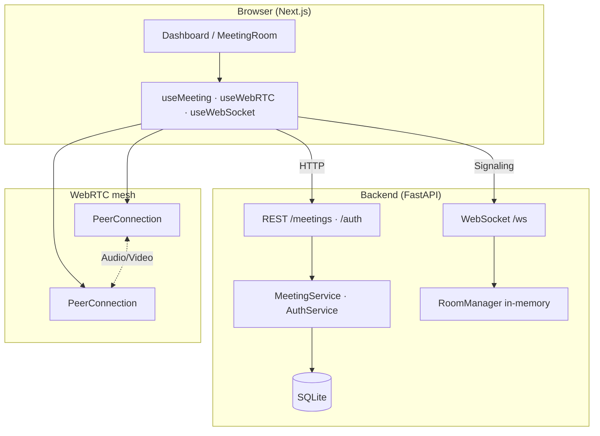
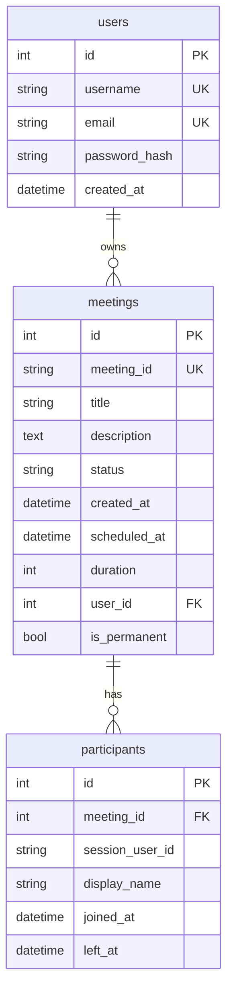

# Zoom Clone

A full-stack video conferencing web app inspired by the Zoom web experience. Create instant or scheduled meetings, join via invite link, and connect over real-time video and audio using WebRTC.

**Live stack:** Next.js · FastAPI · SQLite · WebSockets · WebRTC (mesh, up to 5 participants)

---

## Table of contents

- [Project summary](#project-summary)
- [Features](#features)
- [Architecture overview](#architecture-overview)
- [Backend architecture](#backend-architecture)
- [Frontend architecture](#frontend-architecture)
- [Project structure](#project-structure)
- [Local setup](#local-setup)
- [Database schema](#database-schema)
- [API reference](#api-reference)
- [Deployment](#deployment)
- [Assumptions & limits](#assumptions--limits)
- [Cursor rules](#cursor-rules)

---

## Project summary

This repo is a monorepo with two apps:

| App | Path | Role |
|-----|------|------|
| **Frontend** | `frontend/` | Zoom-style dashboard, pre-join screen, meeting room UI |
| **Backend** | `backend/` | REST API for meetings, WebSocket signaling for WebRTC |

**How a call works:**

1. User lands on `/` (home), signs in, registers, or continues as guest → `/dashboard`.
2. User creates or joins a meeting via REST (`/meetings`, `/join`).
3. Pre-join screen acquires camera/mic and collects display name.
4. After join, the client opens a WebSocket to `/ws/{meeting_id}`.
5. WebRTC offers/answers and ICE candidates are exchanged over the socket (signaling only — media is peer-to-peer).
6. Each participant maintains a mesh of `RTCPeerConnection`s (one per remote peer).
7. On leave, the user returns to `/dashboard` (if signed in or in guest mode).

**Authentication:** Simple register/login with bcrypt password hashing. No JWT — the client stores the logged-in user in `localStorage`. Guests can use the dashboard without an account; guest mode is cleared when returning to the home page `/`.

---

## Features

### Home & auth
- Landing page at `/` with app overview, **Sign in**, **Register**, and **Continue as guest**
- Register: username, email, password, confirm password
- Login: username, password (bcrypt hashed on backend)
- Guest dashboard access without an account; guest session ends when visiting `/` again
- Signed-in users see their username in the navbar with logout

### Dashboard (`/dashboard`)
- Zoom-style UI: search bar, clock, **New meeting** / **Join** / **Schedule** actions
- **Open Rooms** — permanent always-available meetings shown to everyone
- **My Upcoming / My Previous** — personal meetings for signed-in users
- Light/dark theme (Settings drawer)
- Required-field markers on forms (red `*`)

### Meetings
- Instant meetings with UUID + shareable invite link
- Scheduled meetings (title, description, date/time, duration ≤ 45 min)
- **Permanent open rooms** — always joinable, never auto-end when empty (seeded on server start)
- User-owned meetings linked to account via `user_id`
- Join validation (not started / ended / expired) — skipped for permanent rooms
- Pre-join preview with mic/camera toggles; display name pre-filled from username when logged in

### Meeting room
- Multi-participant video grid (max 5)
- Elapsed meeting timer in header
- Mute / camera / participants panel / leave
- Host controls: mute participant, disable video, kick, mute all
- Remote mic/camera state via `media-state` signaling (UI badges)

---

## Architecture overview



| Concern | Implementation |
|---------|----------------|
| Persistence | SQLite via SQLAlchemy |
| Signaling | Native WebSockets (JSON messages) |
| Media | WebRTC P2P mesh, Google STUN |
| Host | First WebSocket joiner; enforced in `RoomManager` |
| Room cap | 5 participants (configurable) |

---

## Backend architecture

### Layered layout

```
Request
   │
   ▼
app/api/meetings.py      ← HTTP routes (thin controllers)
app/api/auth.py          ← Register / login
   │
   ▼
app/services/meeting_service.py   ← Business logic, DB transactions
app/services/auth_service.py      ← User register / login
   │
   ▼
app/models/              ← SQLAlchemy ORM (User, Meeting, Participant)
app/schemas/             ← Pydantic request/response DTOs
app/core/security.py     ← bcrypt password hash / verify
app/db/permanent_meetings.py  ← Always-open room seeding (idempotent)

WebSocket /ws/{id}  →  app/websocket/signaling.py
                      →  app/websocket/room_manager.py (in-memory rooms)
```

### Key modules

| Module | Responsibility |
|--------|----------------|
| `app/main.py` | FastAPI app, CORS, lifespan (`init_db`), router registration |
| `app/core/config.py` | Settings from env (`DATABASE_URL`, `FRONTEND_URL`, `CORS_ORIGINS`) |
| `app/core/meeting_rules.py` | Join windows, 45 min cap, ended-meeting checks; permanent rooms skip expiry |
| `app/core/security.py` | bcrypt password hashing |
| `app/services/meeting_service.py` | CRUD meetings, join/leave, share links, public + user lists |
| `app/services/auth_service.py` | Register / login with duplicate checks |
| `app/db/permanent_meetings.py` | Ensures Open Lounge, Help Desk, Study Hall exist on startup |
| `app/websocket/signaling.py` | Offer/answer/ICE relay, host actions, broadcasts |
| `app/websocket/room_manager.py` | In-memory participant registry + host assignment |
| `app/db/session.py` | Engine, session factory, lightweight migrations |

### WebSocket message types

| Type | Direction | Purpose |
|------|-----------|---------|
| `room-state` | Server → client | Existing participants + host on join |
| `user-joined` / `user-left` | Broadcast | Presence |
| `offer` / `answer` / `ice-candidate` | P2P relay | WebRTC negotiation |
| `media-state` | Broadcast | Mic/camera UI state |
| `host-mute` / `host-video-off` / `host-kick` | Host → target | Host controls |
| `kicked` / `host-changed` | Server → client | Host actions result |

### Meeting lifecycle (backend)

- Created with `status = active`
- Join rejected with **410** if ended or outside join window (permanent rooms exempt from time expiry)
- When the last participant leaves via REST, meeting → `ended` (permanent rooms stay `active`)
- Three permanent open rooms are upserted on every `init_db()` — existing data is never deleted

---

## Frontend architecture

### Layered layout

```
app/                    ← Next.js App Router pages
  page.tsx              ← Landing / home (/)
  dashboard/page.tsx    ← Meetings dashboard
  login/ · register/    ← Auth pages
  meeting/[meetingId]/  ← Pre-join + room
components/
  home/                 ← HomePage (about, sign in, guest)
  auth/                 ← AuthLayout
  dashboard/            ← Dashboard, nav, meeting lists, dialogs
  meeting/              ← Room, pre-join, video grid, controls
  providers/            ← ThemeProvider, AuthProvider
  ui/                   ← shadcn-style primitives
hooks/
  useMeeting.ts         ← Orchestrates API + WS + WebRTC
  useWebRTC.ts          ← Media + peer connections + signaling handler
  useWebSocket.ts       ← WebSocket connection
  usePreJoinMedia.ts    ← Pre-join getUserMedia
lib/
  meeting-rules.ts      ← Client-side join/upcoming logic (mirrors backend)
  config.ts             ← API/WS URLs, ICE servers, room cap
services/
  meeting-api.ts        ← REST client for meetings
  auth-api.ts           ← REST client for auth
store/
  auth-storage.ts       ← localStorage user + guest session
  meeting-session.ts    ← Per-tab meeting session
types/
  meeting.ts · auth.ts  ← Shared TS types
```

### Hook orchestration

`useMeeting` waits for local media (`isMediaReady`) before opening the WebSocket so offers/answers always include tracks.

---

## Project structure

```
Scaler/
├── README.md
├── .cursor/rules/           # Cursor AI conventions (frontend + backend)
├── backend/
│   ├── app/
│   │   ├── api/             # REST routers (meetings, auth)
│   │   ├── core/            # Config, meeting rules, security
│   │   ├── db/              # SQLAlchemy base, session, permanent rooms
│   │   ├── models/          # User, Meeting, Participant
│   │   ├── schemas/         # Pydantic models (auth + meeting)
│   │   ├── services/        # MeetingService, AuthService
│   │   ├── websocket/       # Signaling + RoomManager
│   │   └── main.py
│   ├── seed.py              # Sample meetings
│   └── requirements.txt
└── frontend/
    ├── src/
    │   ├── app/             # home, dashboard, login, register, meeting/[id]
    │   ├── components/      # home, auth, dashboard, meeting, providers
    │   ├── hooks/
    │   ├── lib/
    │   ├── services/
    │   ├── store/
    │   └── types/
    └── package.json
```

---

## Local setup

### Prerequisites

- **Node.js** 18+
- **Python** 3.11+ (3.12 recommended)
- **npm**

### 1. Backend

```bash
cd backend
python -m venv venv
source venv/bin/activate          # Windows: venv\Scripts\activate
pip install -r requirements.txt   # includes bcrypt, email-validator (for auth)
python seed.py                    # optional: sample data
uvicorn app.main:app --reload --host 0.0.0.0 --port 8000
```

**Backend dependencies** (`requirements.txt`): `fastapi`, `uvicorn`, `websockets`, `python-dotenv`, `pydantic`, `email-validator`, `sqlalchemy`, `bcrypt`

> **Railway / production:** Ensure `backend/requirements.txt` is committed and pushed — auth requires `email-validator` and `bcrypt`. If deploy fails with `ModuleNotFoundError: email_validator`, redeploy after pushing the latest `requirements.txt`.

- API: http://localhost:8000  
- Swagger: http://localhost:8000/docs  
- Health: http://localhost:8000/health  

**Optional env** (`backend/.env`):

| Variable | Default | Description |
|----------|---------|-------------|
| `DATABASE_URL` | `sqlite:///./zoom_clone.db` | SQLAlchemy URL |
| `FRONTEND_URL` | `http://localhost:3000` | Base URL for invite links |
| `CORS_ORIGINS` | localhost origins | Comma-separated CORS list |

### 2. Frontend

```bash
cd frontend
npm install
```

Create `frontend/.env.local`:

```env
NEXT_PUBLIC_API_URL=http://localhost:8000
NEXT_PUBLIC_WS_URL=ws://localhost:8000
```

```bash
npm run dev
```

App: http://localhost:3000

### 3. Quick test

1. Open http://localhost:3000 (home page)  
2. Click **Continue as guest** or **Register** / **Sign in**  
3. On `/dashboard`, click **New meeting** → start → allow camera/mic  
4. Copy invite link → open in a second browser/tab  
5. Join with another display name → verify two-way video/audio  
6. Click **Leave** → should return to `/dashboard`  
7. Open **Open Rooms** (e.g. Open Lounge) → join anytime without scheduling  

### Seed data

```bash
cd backend
python seed.py          # skip if DB already has rows
python seed.py --force  # wipe and re-seed
```

Inserts upcoming + recent sample meetings and participant history.

---

Inserts upcoming + recent sample meetings and participant history. Permanent open rooms (Open Lounge, Help Desk, Study Hall) are created automatically by `init_db()` and are not removed by the seed script.

---

## Database schema

### `users`

| Column | Type | Description |
|--------|------|-------------|
| `id` | Integer PK | Internal ID |
| `username` | String | Unique login name |
| `email` | String | Unique email |
| `password_hash` | String | bcrypt hash |
| `created_at` | DateTime | UTC |

### `meetings`

| Column | Type | Description |
|--------|------|-------------|
| `id` | Integer PK | Internal ID |
| `meeting_id` | String UUID | Public ID in URLs |
| `title` | String | Meeting name |
| `description` | Text | Optional |
| `status` | String | `active` \| `ended` |
| `created_at` | DateTime | UTC |
| `scheduled_at` | DateTime | Optional scheduled start |
| `duration` | Integer | Minutes (max 45 when scheduled) |
| `user_id` | Integer FK | Owner (null for guests / permanent rooms) |
| `is_permanent` | Boolean | Always-open public room; never auto-ends |

### `participants`

| Column | Type | Description |
|--------|------|-------------|
| `id` | Integer PK | Internal ID |
| `meeting_id` | Integer FK | → `meetings.id` |
| `session_user_id` | String UUID | Per-session WebRTC/signaling ID |
| `display_name` | String | Name from pre-join |
| `joined_at` | DateTime | UTC |
| `left_at` | DateTime | Null while in meeting |



Invite links are computed at runtime: `{FRONTEND_URL}/meeting/{meeting_id}` (not stored in DB).

---

## API reference

### Auth

| Method | Path | Body | Description |
|--------|------|------|-------------|
| `POST` | `/auth/register` | `{ username, email, password, confirm_password }` | Create account |
| `POST` | `/auth/login` | `{ username, password }` | Login; returns `{ id, username, email }` |

No JWT or server-side sessions — the frontend stores the user in `localStorage`.

### Meetings

| Method | Path | Description |
|--------|------|-------------|
| `POST` | `/meetings` | Create meeting (optional `user_id` for owner) |
| `GET` | `/meetings?user_id=` | List `{ public_meetings, my_meetings }` |
| `GET` | `/meetings/{meeting_id}` | Get one meeting |
| `POST` | `/meetings/{meeting_id}/join` | Join (returns session IDs) |
| `POST` | `/meetings/{meeting_id}/leave?session_user_id=` | Leave |
| `WS` | `/ws/{meeting_id}?user_id=&display_name=` | Signaling |
| `GET` | `/health` | Health check |

**List response:** `public_meetings` = permanent always-open rooms (everyone). `my_meetings` = meetings where `user_id` matches the query param (signed-in users only).

---

## Deployment

| Service | Platform | Root directory | Notes |
|---------|----------|----------------|-------|
| Frontend | Vercel | `frontend` | Set `NEXT_PUBLIC_*` env vars |
| Backend | Railway / Render | `backend` | `uvicorn app.main:app --host 0.0.0.0 --port $PORT` |

**Production checklist**

- [ ] Push latest `backend/requirements.txt` (`email-validator`, `bcrypt` required for auth)
- [ ] `NEXT_PUBLIC_API_URL` → `https://your-api...`
- [ ] `NEXT_PUBLIC_WS_URL` → `wss://your-api...`
- [ ] `FRONTEND_URL` + `CORS_ORIGINS` on backend
- [ ] HTTPS required for `getUserMedia` in production
- [ ] Consider TURN servers for restrictive networks (STUN-only today)
- [ ] SQLite on Railway is ephemeral unless a volume is attached — use Postgres for persistent production data

---

## Assumptions & limits

1. **Simple auth** — bcrypt password hashing only; no JWT. Client passes `user_id` on meeting create/list (trust-based, suitable for assignment scope).
2. **Guest mode** — stored in `localStorage`; cleared when visiting `/`. Invite links work without login.
3. **Permanent rooms** — Open Lounge, Help Desk, Study Hall; always joinable, shown to all users.
4. **SQLite** — fine for dev/demo; use Postgres + persistent volume in production.
5. **Mesh WebRTC** — each pair has a peer connection; scales to 5 participants.
6. **In-memory rooms** — `RoomManager` is single-process; multi-instance needs Redis/shared state.
7. **Host** — first WebSocket joiner; host-only actions validated server-side.
8. **Duration** — scheduled meetings capped at 45 minutes; permanent rooms have no expiry.

---

## Cursor rules

Project conventions for AI-assisted development live in:

- [`.cursor/rules/frontend.mdc`](.cursor/rules/frontend.mdc) — Next.js, hooks, UI patterns
- [`.cursor/rules/backend.mdc`](.cursor/rules/backend.mdc) — FastAPI, services, WebSocket

---

## License

Built as an SDE Fullstack assignment project.
